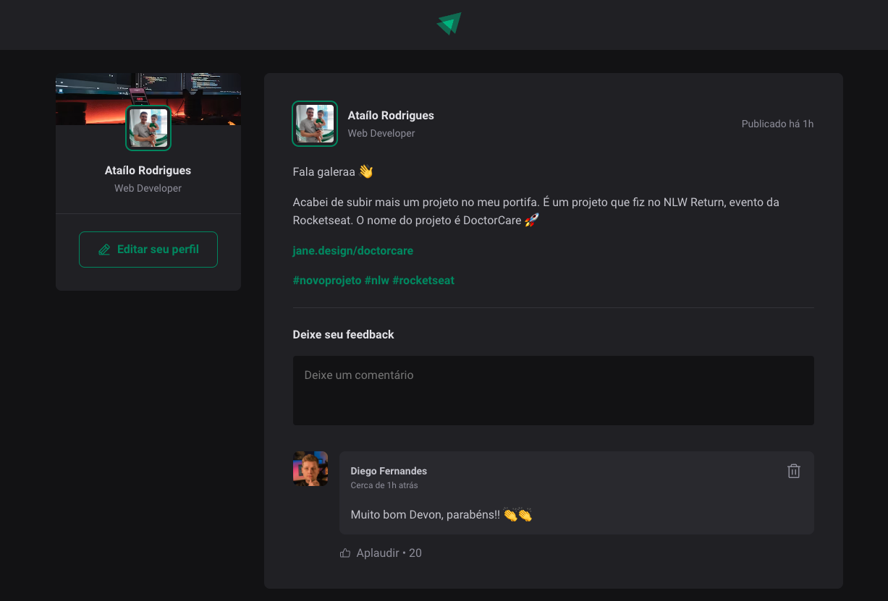

#React project that shows a feed of posts and comments

**Exercise that is part of the IGNITE course at Rocketseat school**

**Languages**

1- HTML;
2- CSS;
3- JavaScript.

**Tools**

1- Vite;
2- CSS modules;
3- React.

**To use:**

1- Download ZIP;
2- Extracts;
3- Open folde in VS code;
4- excute npm install;
5- execute npm run dev;
6- Open in browser;

